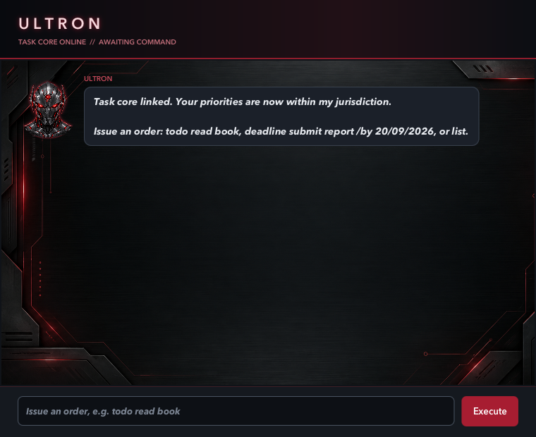

# Ultron User Guide

**Ultron** is a JavaFX task manager for keeping todos, deadlines, and events in one place. It presents your
tasks through a focused command-console interface and stores them locally between sessions.



## Quick start

1. Open a terminal in the project folder.
2. Run `./gradlew run`.
3. Enter a command in the input field.
4. Select **Execute** or press <kbd>Enter</kbd>.

For example, enter:

```text
todo read book
```

Ultron confirms that the task was acquired. Your tasks are saved locally in `data/ultron.txt`.

## Command summary

| What you want to do | Command |
| --- | --- |
| Add a todo | `todo DESCRIPTION` |
| Add a deadline | `deadline DESCRIPTION /by DATE [TIME]` |
| Add an event | `event DESCRIPTION /from START /to END` |
| List every task | `list` |
| Find matching tasks | `find KEYWORD` |
| Mark a task complete | `mark NUMBER` |
| Mark a task active again | `unmark NUMBER` |
| Delete a task | `delete NUMBER` |
| Reschedule a deadline | `reschedule NUMBER DAYSd` or `reschedule NUMBER /by DATE [TIME]` |
| Exit Ultron | `bye` |

`NUMBER` is the task number shown by `list` or `find`. Command words are lowercase.

## Features

### Add a todo

Use a todo for work without a specific time.

```text
todo read book
```

The description cannot be empty.

### Add a deadline

Use a deadline for work due on a particular date, with an optional 24-hour time.

```text
deadline submit report /by 20/09/2026
deadline submit report /by 20/09/2026 1800
```

Dates use `d/MM/yyyy`; times use four-digit `HHmm` format. For example, `1800` means 6:00 pm. Ultron rejects
impossible dates such as `30/02/2026`, invalid times such as `2460`, missing `/by`, and repeated `/by` markers.

### Add an event

Use an event for an activity with a start and end detail.

```text
event project meeting /from Mon 2pm /to 4pm
```

Both `/from` and `/to` must be supplied exactly once, and each must have a value.

### View and find tasks

Use `list` to show every task in its current numbered order.

```text
list
```

Use `find` to show tasks whose description contains the keyword.

```text
find report
```

The matching tasks retain their original task numbers, so you can use those numbers in a later command.

### Mark, unmark, and delete tasks

Use a task number from `list` or `find`.

```text
mark 2
unmark 2
delete 2
```

`mark` records a task as complete. `unmark` makes it active again. `delete` permanently removes it from the
current task list.

### Reschedule a deadline

Only incomplete deadlines can be rescheduled. Rescheduling a todo or event is rejected.

To postpone a deadline by a positive number of days:

```text
reschedule 2 3d
```

To set a specific date, optionally replacing the time:

```text
reschedule 2 /by 20/09/2026
reschedule 2 /by 20/09/2026 1800
```

The new date must be today or later. If no time is supplied, the deadline keeps its existing time.

### Exit Ultron

```text
bye
```

Ultron preserves your saved tasks before disengaging.

## Handling errors

Ultron stays open when a command needs correction and shows an alert that explains the problem. It accepts
leading, trailing, and repeated spaces around command parts. Common problems include a missing description,
missing or repeated `/by`, `/from`, or `/to` markers, an invalid task number, and an invalid date or time.

If `data/ultron.txt` does not exist yet, Ultron starts with an empty task list and creates the file when the
first task is saved. If a saved file contains a malformed line, Ultron skips only that line and loads the other
valid tasks.

## Credits

The Ultron-themed avatar and console background artwork were generated with OpenAI image generation. The
Checkstyle configuration is adapted from
[se-edu/addressbook-level3](https://github.com/se-edu/addressbook-level3/tree/master/config/checkstyle).
